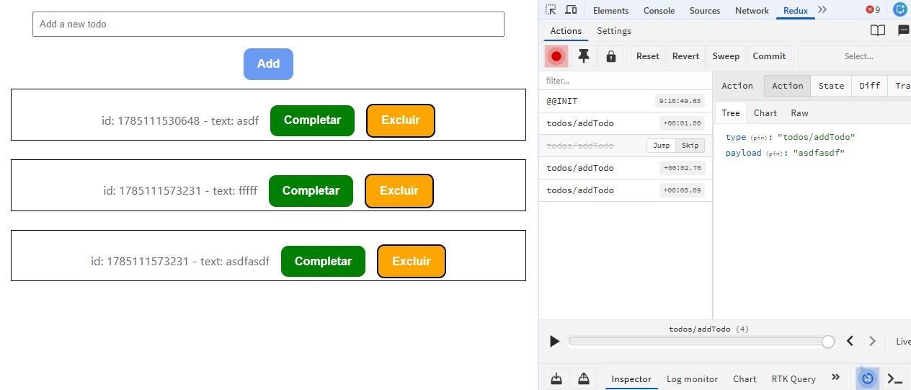

# React Redux Todo

App simples usando redux, com `React 19`, `TypeScript`, and `Redux Toolkit`.

## Redux DevTools
Se tiver algum erro relacionado a dados, e quiser debugar podend reverter o status para um anterior, partiu.



## Tech Stack

- React 19 + TypeScript
- Redux Toolkit + React Redux
- Vite 8 (Rolldown)
- Oxlint

## Getting Started

```bash
npm install ou (npm i)
npm run dev (para apagar cache `--force`)
```

## Project Structure

```
src/
  components/todo/   # TodoForm, TodoLista, TodoItem
```
